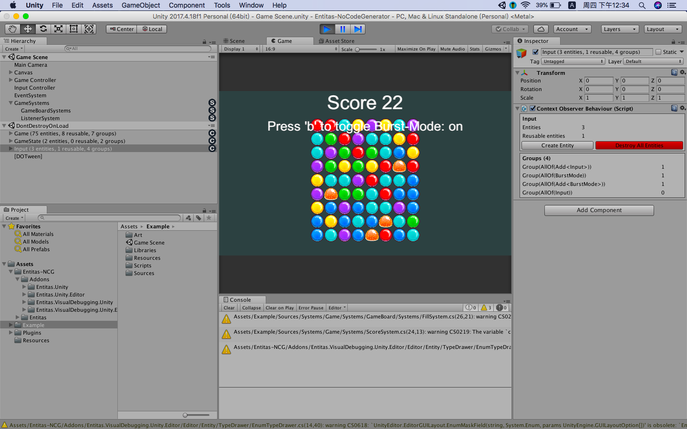

# EasyEntitas
based on the entitas and entitas-lite



1）增加了reactive system的支持。
2）可以正确的触发值类型的改变事件。
3）全新的接口，消除歧义，使用习惯更贴近于entitas本体。
4）增加各种单例事件的监听事件。
5）一系列的bug修正等。

事件相关：
```csharp
	public virtual void Link(IEntity entity, IContext context) {
	gameObject.Link(entity, context);
	e = (Entity)entity;
	e.AddListener<PositionComponent>(this);
	e.AddListener<DestroyedComponent>(this);

	var pos = e.Get<PositionComponent>().value;
	transform.localPosition = new Vector3(pos.x, pos.y);
	}
```
基于委托的初始化：
```csharp
	Contexts.Get<Input>().CreateEntity().Add<InputComponent>(x =>
	{
		x.x = (int) pos.x;
		x.y = (int) pos.y;
	});
```
        
官方的单消例子是跑起来了，剩下的自己看代码吧
